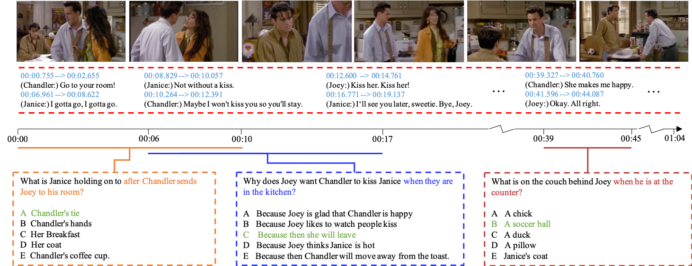
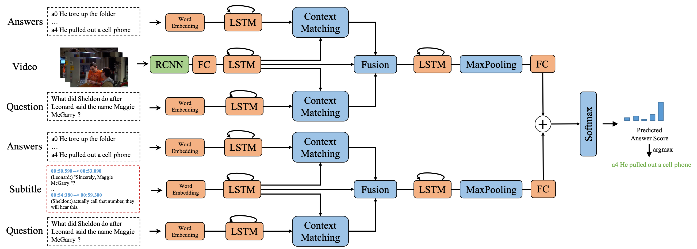

# TVQA
PyTorch code accompanies the [TVQA dataset paper](https://arxiv.org/abs/1809.01696), in EMNLP 2018


### Dataset
TVQA is a large-scale video QA dataset based on 6 popular TV shows 
(*Friends*, *The Big Bang Theory*, *How I Met Your Mother*, *House M.D.*, *Grey's Anatomy*, *Castle*). 
It consists of 152.5K QA pairs from 21.8K video clips, spanning over 460 hours of video. 
The questions are designed to be compositional, requiring systems to jointly localize 
relevant moments within a clip, comprehend subtitles-based dialogue, and recognize 
relevant visual concepts.

- QA example

    

    See examples in video: [click here](http://tvqa.cs.unc.edu/explore.html)
- Statistics

    | TV Show               | Genre   | #Season | #Episode | #Clip  | #QA     |
    |-----------------------|---------|---------|----------|--------|---------|
    | The Big Bang Theory   | sitcom  | 10      | 220      | 4,198  | 29,384  |
    | Friends               | sitcom  | 10      | 226      | 5,337  | 37,357  |
    | How I Met Your Mother | sitcom  | 5       | 72       | 1,512  | 10,584  |
    | Grey's Anatomy        | medical | 3       | 58       | 1,472  | 9,989   |
    | House M.D.            | medical | 8       | 176      | 4,621  | 32,345  |
    | Castle                | crime   | 8       | 173      | 4,698  | 32,886  |
    | Total                 | -       | 44      | 925      | 21,793 | 152,545 |


### Model Overview
A multi-stream model, each stream process different contextual inputs. 


### Requirements:
- Python 2.7
- PyTorch 0.4.0
- tensorboardX
- pysrt
- tqdm
- h5py
- numpy

### Video Features
- ImageNet feature: Extracted from ResNet101, 
  [Google Drive link](https://drive.google.com/a/cs.unc.edu/file/d/1klm3FUJMCRPJjHZx497MvpGzrSrXgGIl/view?usp=sharing)
- Regional Visual Feature: object-level encodings from object detector (too large to share ...)
- Visual Concepts Feature: object labels and attributes from object detector
  [download link](http://tvqa.cs.unc.edu/files/det_visual_concepts_hq.pickle.tar.gz). This file is included in `download.sh`.

For object detector, we used Faster R-CNN trained on Visual Genome, please refer to this 
[repo](https://github.com/peteanderson80/bottom-up-attention).
  
### Usage

0. Clone this repo

    ```
    git clone https://github.com/jayleicn/TVQA.git
    ```

1. Download data

    Questions, answers and subtitles, etc. can be directly downloaded by executing the following command:
    ```
    bash download.sh
    ```
    For video frames and video features, please visit [TVQA Dwonload Page](http://tvqa.cs.unc.edu/index.html#download).

2. Preprocess data

    ```
    python preprocessing.py
    ```
    This step will process subtitle files and tokenize all textual sentence.

3. Build word vocabulary, extract relevant GloVe vectors
    
    For words that do not exist in GloVe, random vectors `np.random.randn(self.embedding_dim) * 0.4` are used. 
    `0.4` is the standard deviation of the GloVe vectors
    ```
    mkdir cache
    python tvqa_dataset.py
    ```

4. Training
    ```
    python main.py --input_streams sub
    ```

5. Inference
    ```
    python test.py --model_dir [results_dir] --mode valid
    ```


### Results
Please note this is a better version of the original implementation we used for EMNLP paper. 
Bascially, I rewrote some of the data preprocessing code and updated the model to the latest 
version of PyTorch, etc. By using this code, you should be able to get slightly 
higher accuracy (~1%) than our paper.

### Links
- Paper: https://arxiv.org/abs/1809.01696
- Dataset and Leaderboard: http://tvqa.cs.unc.edu/


### Citation
```
@inproceedings{lei2018tvqa,
  title={TVQA: Localized, Compositional Video Question Answering},
  author={Lei, Jie and Yu, Licheng and Bansal, Mohit and Berg, Tamara L},
  booktitle={EMNLP},
  year={2018}
}
```

### TODO
1. [x] Add data preprocessing scripts
2. [ ] Add baseline scripts
3. [x] Add model and training scripts
4. [x] Add test scripts


### Contact
- Dataset: faq-tvqa-unc [at] googlegroups.com
- Model: Jie Lei, jielei [at] cs.unc.edu
